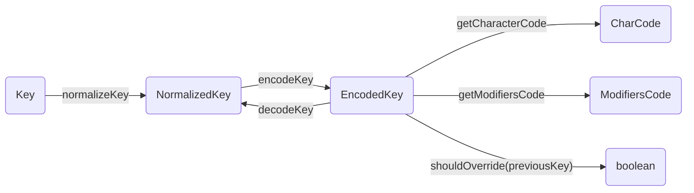

# ctrl-keys internals documentation

This document explains the structure of the source code to help anyone who wants to understand how this library works internally or wants to contribute to it.

## Contents

## Introduction

...

## Files structure

```bash
src/
  constants.ts      # shared constants
  event.ts          # functions handling events
  Handler.ts        # keybindings handler class
  index.ts          # the entrypoint
  key.ts            # functions handling keys
  sequence.ts       # functions handling sequences
  state.ts          # functions handling state of a handler
  test-utils.ts     # handy functions for tests
  types.ts          # type definitions
```

## keys functions

